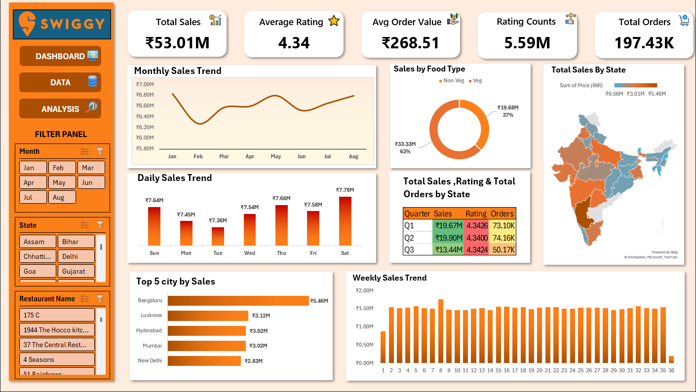
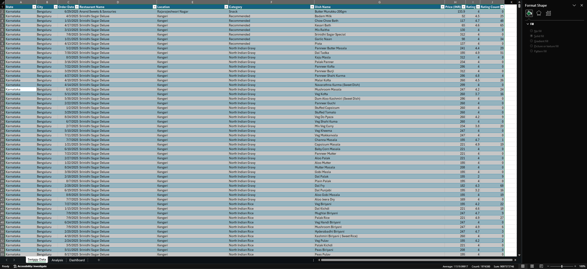
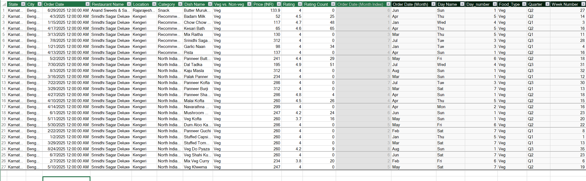

# Swiggy Sales Analysis Project 📊

## 📌 Project Overview
This project provides a comprehensive analysis of **Swiggy's sales data**, aiming to uncover key business insights, customer behavior, and sales performance across different regions. By utilizing **Excel Power Tools**, this analysis transforms raw data into an interactive visual experience to support data-driven decision-making.

---

## 🖥️ Project Dashboard
The primary focus of this project is the interactive dashboard which provides a high-level summary of all critical metrics (KPIs) and trends.

---

## 🛠️ Tools & Technologies Used
* **Microsoft Excel:** Core platform for data processing and visualization.
* **Power Query:** Used for Data Cleaning, Transformation, and ETL processes.
* **Power Pivot:** Used for building the **Data Model** and establishing relationships between tables.
* **DAX (Data Analysis Expressions):** Created custom measures for KPIs like Total Revenue, Order Count, and Average Order Value.

---

## 🏗️ Data Architecture & Modeling

### 1. Raw Data
The analysis started with a large dataset containing order details, restaurant information, and delivery metrics.

### 2. Data Modeling (Power Pivot)
A robust data model was created to efficiently handle the relationships between different data entities, ensuring fast and accurate calculations.

---

## 🔑 Key Insights & KPIs
The dashboard focuses on several key performance indicators:
* **Total Revenue & Growth:** Tracking sales performance over time.
* **Geographical Analysis:** Visualizing sales distribution across different states/cities in India.
* **Customer Segmentation:** Understanding order patterns and preferences.
* **Category Performance:** Identifying top-performing food categories and restaurants.

---

## 📂 Project Files
* `Swiggy-Sales-Analysis.xlsx`: The main Excel file containing the data, model, and dashboard.
* `/Images`: Folder containing screenshots of the dashboard and data model.

---

## 🚀 How to Use
1. Clone this repository to your local machine.
2. Open the `Swiggy-Sales-Analysis.xlsx` file.
3. Use the **Slicers** on the left side of the dashboard to filter data by date, region, or category.

---
**Developed by Ahmed Osama** *Aspiring Data Analyst*